# Introduction/Background
National and regional differences have had significant policy implications for global sustainability; such geopolitical and cultural differences have led to divergent outcomes on a range of social, economic, and environmental measures. Understanding the current trajectory, and disparate outcomes, by utilizing statistical learning is critical in identifying key trends that can inform future global sustainability efforts.
<br />
<br />
Prior literature has demonstrated such analysis on a regional scale. Mathrani et al. analyze national data for Asian nations from the 2022 United Nations Sustainable Development Goal (SDG) Report. They find, that across four major dimensions of sustainability, sub-regions in Asia perform differently. Most notably, West and Central Asian nations performed well in economic sustainability, while East Asian nations performed well in social and institutional sustainability.
<br />
<br />
A previous study used 2019 UN SDG data and clustered all nations using K-Means. The study identified five clusters which were then analyzed. The resulting clusters were found to have similar characteristics in SGD progress, as well as social, economic, and political characteristics. 
These studies focus on the UN SDGs, which aim to harmonize economic, social, and environmental measures (Di Vaio et al., 2020a). While this approach utilizes data with numerous features for analysis, it is limited in its time span. Our approach aims to widen the scope of analysis temporally.

# Dataset 
For this project we will be using the [World Sustainability Dataset](https://www.kaggle.com/datasets/truecue/worldsustainabilitydataset). The WSD tracks the performance of 173 countries against a range of sustainability metrics over a 19-year period. One example of a metric is "Access to Electricity (%)". One can see why this metric is useful in determining the prosperity and overall wellbeing of a country. The dataset was formed from many different merged data sources. 
<br />
For additional data on the countries' location (region, subregion, region-code, etc), we have merged another dataset that holds the metadata for all the countries in the WSD. 
```
merged = main_df.join(
    regions_df,
    left_on="Country Name",
    right_on="name",
    how="left"
)
```

# Problem definition
Given the World Sustainability Dataset we want to cluster countries by relevant features that correspond to the economic, environmental, and social prosperity of the country. (Note: these categories of prosperity are not comprehensive and are subject to change) Determining which columns from this dataset correspond to these categories will be a preprocessing step we must do before. Once these clusters are created we want to map the country codes from each cluster to their geographic location and notice correlation between location and any of categories of prosperity. Once a relationship is determined we can use these findings to understand which parts of the world perform best and worst in certain areas. In doing so we can take proper steps to accurately address the shortcomings of countries that are not prospering. Additionally, because some of the data is chronological we can potentially predict a country becoming an outlier in their cluster, and if this is in a negative direction, our findings can help inform which sectors of prosperity must be worked on. 

# Data Preprocessing

### Removing Redundant Columns  
With the dataset merged with region metadata the first step we took was to drop redundant or uninformative metadata columns such as "country-code" or "World Regions (UN SDG Definition)". These columns became redundant when the region metadata merged with the original dataset since the original dataset had already contained some metadata for each country.

### Dealing with Null Values 
Next we had to deal with null or empty data points. After iterating through all the columns we determined these 4 columns to have a ratio of null/zero values to be above 0.5.
<br />

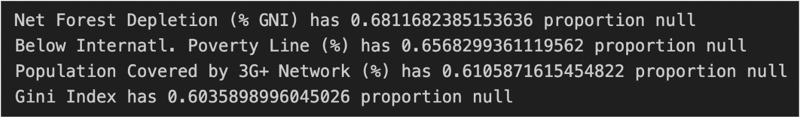
Note: we consider 0.0 to be as informative as null because 0.0 for any column is too extreme of a value to be truthful. It is more likely that 0.0 represents a lack of data. 
<br />
<br />
For columns with less than 50% nulls we use backwards filling because the dataset comes sorted by country and sorted in chronological order. Therefore, a null value will be populated by the most recent non-null value for that country. In the case where backwards filling cannot be achieved we instead interpolate the data with forwards filling. 

### Non numeric values 
There exists non numeric columns within the dataset that need to be enumerated. Namely, the “Regime Type” column has values: “Closed Autocracy”, “Electoral Autocracy”, “Electoral Democracy”. Therefore we enumerate these values using a one-hot encoding method. 
```
encoding = pd.Series(pd.factorize(df["Regime Type"])[0], index=df.index)
encoding.name = "encoding"

df = df.merge(encoding, left_index=True, right_index=True, how="inner").drop(
    columns='Regime Type'
).rename(
    columns={'encoding': 'Regime Type'}
)
```
### Further Dropping of Columns 
Because we are clustering, the time-seried nature of the data is not too useful to us. Therefore we will drop all duplicate countries and only keep its most recent instance. Furthermore, to prepare for dimensionality reduction we will remove the metadata columns. However, when these columns are merged back they should be sorted in the same order as the PCA components so they describe the correct data points (this would mean sorting by name and then year). 
```
df = df.drop_duplicates(subset=['Alpha-2'], keep='last')
```

### Dropping highly correlated features 
Before performing PCA for dimensionality reduction we must drop highly correlated features from the dataset. If 2 features are highly correlated then their combined contribution to the captured variance would be around the same as 1 of the feature’s contribution to total variance. Without dropping one of the highly correlated features, a PCA component can overestimate the highly correlated features' contribution to total variance. Overall, not inspecting the correlation between individual features, can lead to an inaccurate dimensionality reduction.
```
init_corr = df.corr()
init_corr_viz = utils.viz_corr_heatmap(init_corr.abs(), False)
init_corr_viz.show()
```
We can visualize the covariance matrix (d x d) through the following graph:
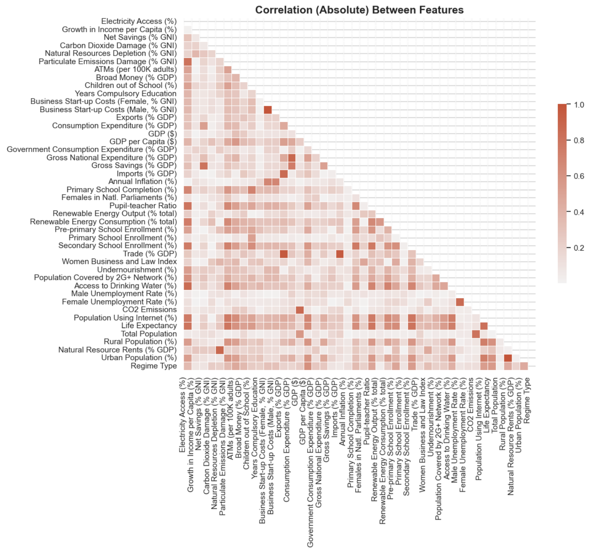
Note: The **absolute values** in the covariance matrix have been graphed. 
<br />
<br />
We will iterate through every feature and inspect all features that have a correlation with the given feature greater than 0.6 (a value we chose). For example, these are the features that are highly correlated with “Electricity Access (%)”:

| Feature    | Correlation |
| -------- | ------- |
| Particulate Emissions Damage (% GNI) | 0.806976 |
| Primary School Completion (%) | 0.693028 |
| Pupil-teacher Ratio | 0.794421 |
| Renewable Energy Consumption (% total) | 0.743342 |
| Secondary School Enrollment (%) | 0.756570 |
| Population Covered by 2G+ Network (%) | 0.609961 |
| Access to Drinking Water (%) | 0.850980 |
| Population Using Internet (%) | 0.764076 |
| Life Expectancy | 0.799997 |


The following lists were created for all features.
<br />
<br />
From these findings, we make the following decisions:
1. Keep Natural Resources Rents, but drop Natural Resource Depletion. We do not believe there is much additional value in keeping both, and Rents captures more information due to its economic implications.
2. Drop Business Start-up Costs Male and keep Business Start-up Costs Female. These appear to be identical features.
3. Drop Gross National Expenditure and keep Consumption Expenditure; both are very similar, but we prefer looking consumption specifically due to its environmental implications.
4. Drop Coverage by 2G and 3G Networks but keep Internet Usage; we feel actual ability to use of internet easily (say, through a library or other public service) is more important than potentially expensive 2G or 3G services.
5. Drop Urban Population but keep Rural Population. These features are very similar but Urban Population was more correlated with other features, so we choose to keep Rural Population.

```
# Feature Selection
df_uncorr = df_uncorr.drop(
    columns=[
        "Exports (% GDP)",
        "Imports (% GDP)",
        "Trade (% GDP)",
        "CO2 Emissions",
        "Natural Resources Depletion (% GNI)",
        "Business Start-up Costs (Male, % GNI)",
        "Gross National Expenditure (% GDP)",
        "Urban Population (%)"
    ]
)
```

### Feature Engineering 
To further reduce features we can drop imports, exports, and trade because they are all highly correlated and instead create a trade deficit feature which is equal to exports - imports. Additionally, we believe CO2 emissions to be an uninformative feature because it is based on total population, and countries differ drastically in population. Therefore, we replace CO2 emissions with “CO2 emissions per Capita” which is equal to CO2 emissions / total population. 
```
# Feature Engineering
df_uncorr["Trade Deficit (% GDP)"] = (
    df_uncorr["Exports (% GDP)"] - df_uncorr["Imports (% GDP)"]
)

# CO2 Emissions were Measured in Million Tonnes
df_uncorr["CO2 Emissions per Capita"] = (
    df_uncorr["CO2 Emissions"] * 1000000 / df_uncorr["Total Population"]
)
```
### PCA 
With our cleaned dataset we run PCA and find that the optimal number of PCA components is 25. This is because 25 PCA components is where we obtain a captured variance level of 0.95 

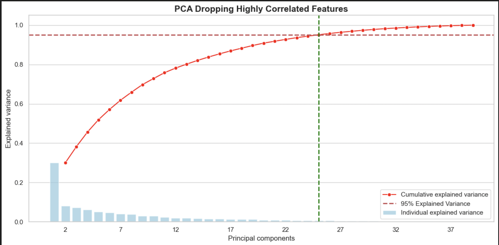

### PCA Feature Analysis 
In order to determine which of the original features contribute to each PCA component we create a heatmap (for the first 12 components due to space limitations). Each cell in the map will represent how much weight each of the original features (after data cleaning and feature engineering) contribute to each PCA component. The weight is found from the coefficient of that feature in the linear combination of each PCA component. If the weight is close to -1 or 1, that feature is considered to contribute substantially to that PCA component. 

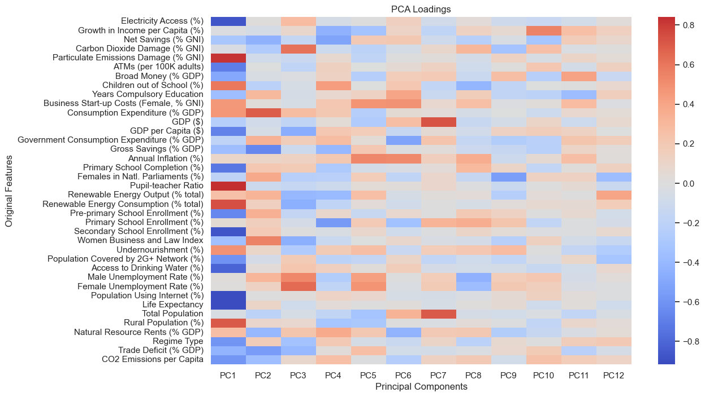

A numerical analysis shows the above with precision (sample shown below):

> PC1 top 5 features and explained variance: \
> Life Expectancy: 0.8397 \
> Population Using Internet (%): 0.8397 \
> Electricity Access (%): 0.7635 \
> Secondary School Enrollment (%): 0.7616

> PC2 top 5 features and explained variance: \
> Consumption Expenditure (% GDP): 0.4801 \
> Gross Savings (% GDP): 0.4304 \
> Trade Deficit (% GDP): 0.3146 \
> Women Business and Law Index: 0.3123

Based on the data we can categorize the first 7 PCA components based on the similarities of the features that heavily contribute to the component. 

- PC1: Human Development 
- PC2: Trade 
- PC3: Business Practices 
- PC4: Personal Wealth 
- PC5: Personal Economic / Business Environment 
- PC6: National Economic / Business Environment 
- PC7: Capital and Human Resources 

Unfortunately, after PC7 it's hard to determine a common theme among features. Overall, this analysis will be useful to determine which countries do well in Human Development, Trade, etc when the data is plotted in the z-space from the PCA components. 

# Methods
After performing PCA, we will use these components to perform GMM and hierarchical clustering, then analyze and visualize the results to identify inter-region and intra-regional trends.

Results of clustering will be evaluated using internal measures because the dataset does not contain labels. The effectiveness of the clustering will be evaluated using methods such as Silhouette Coefficient, normalized cut, Beta-CV, and Davies-Bouldin Index. More specifically, for GMM, we will use BIC score to determine the optimal number of components to use in the analysis, and then validate the clustering with the Silhouette score.

# Results and Discussion
## Hierarchical Clustering

### Determining the Optimal number of clusters

Using our reduced dataset, we constructed a dendrogram using hierarchical clustering. 
```
linkage_matrix = linkage(data, 'ward') 
fig = plt.figure(figsize=(50, 50))
dn = dendrogram(linkage_matrix)
plt.title("World Sustainability Dendrogram")
plt.xlabel("Index of point")
plt.show()
```
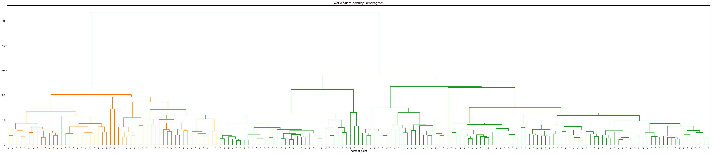

Due to the structure of the reduced data, the dendrogram shows the index of individual points where appropriate, and a higher depth is required to see where other data points are clustered. However, there are hundreds of datapoints, so they are difficult to individually label in a dendrogram. Regardless, the structure of the dendrogram can help us determine the optimal amount of clusters. 
<br>
<br>
Another data structure we can look at to help us determine the optimal number of clusters is the linkage matrix. The structure of the linkage matrix will be (N - 1, 4). Each row of the linkage matrix represents 
a merging of 2 clusters. Here is part of the linkage matrix:
<br>
<br>
```
[ 44.        ,  53.        ,   1.88994741,   2.        ],
[140.        , 174.        ,   1.90087188,   3.        ],
[127.        , 139.        ,   2.01059507,   2.        ],
[ 58.        , 143.        ,   2.02071585,   2.        ],
[115.        , 173.        ,   2.1303943 ,   3.        ],
[ 33.        ,  43.        ,   2.21874849,   2.        ],
[ 48.        , 105.        ,   2.28122269,   2.        ],
[ 24.        , 130.        ,   2.28715035,   2.        ],
[ 15.        , 114.        ,   2.36380808,   2.        ],
[ 72.        , 120.        ,   2.40411764,   2.        ],
[ 20.        , 135.        ,   2.46453695,   2.        ],
[  8.        , 128.        ,   2.4899263 ,   2.        ],
[ 90.        , 179.        ,   2.55922116,   3.        ],
[104.        , 136.        ,   2.57177356,   2.        ],
[  0.        ,  61.        ,   2.60297966,   2.        ],
[ 27.        , 109.        ,   2.60548906,   2.        ],
[ 71.        , 102.        ,   2.69120678,   2.        ],
[  4.        , 180.        ,   2.76417816,   3.        ],
[176.        , 181.        ,   2.804367  ,   4.        ],
[106.        , 187.        ,   2.80926436,   3.        ],
[  5.        , 108.        ,   2.82883208,   2.        ],
```

- Index 0: Cluster Index (Individual points are considered clusters)
- Index 1: Cluster Index  (Individual points are considered clusters)
- Index 2: Distance between the 2 clusters 
- Index 3: How many points are in the newly formed cluster 

### Visualizing Linkage Matrix 
Because each row represent a merge step in the hierarchical clustering process, we can plot the distance 
across each merge step (row index of linkage matrix). We will inspect where the distance shoots up greatly
and determine the optimal number of clusters by the number of clusters at that merge step. This is because
a hike in distance means that 2 relatively far clusters got merged together, a merge we would not want to happen. We can visualize this relationship with the following code:
```
plt.figure(figsize=(10, 8))

plt.title('Cluster Distance Each Step')
steps = [i for i in range(1, linkage_matrix.shape[0] + 1)]
distances = linkage_matrix[:, 2]
plt.xlabel('Step')
plt.ylabel('Distance')
plt.plot(steps, distances)
plt.show()
```
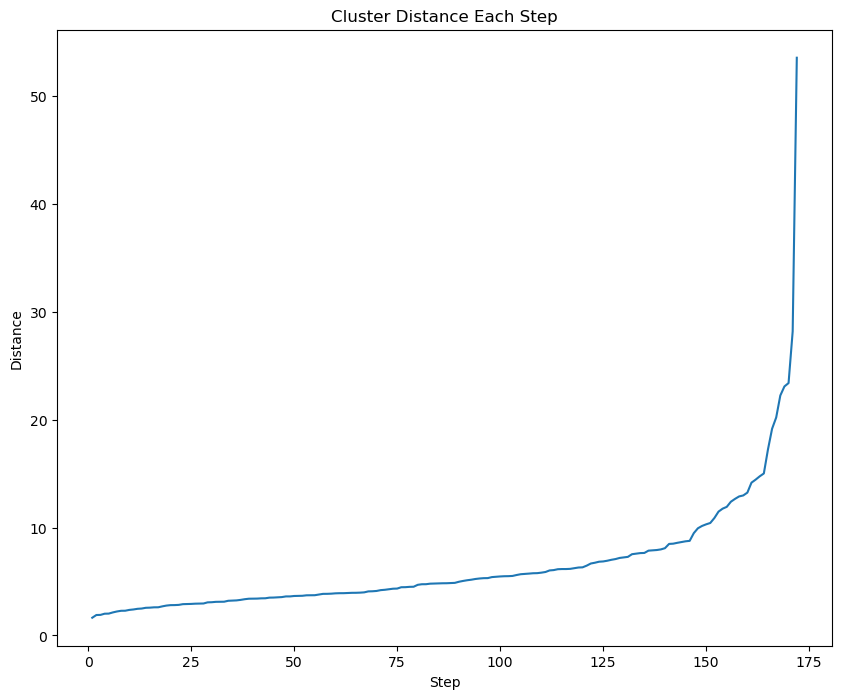

We see the spike happens around merge step ~160. After some interpolation of the cluster indices the linkage matrix assigns, we determine the optimal number of clusters is 2. Additionally, we can inspect the dendrogram and see that there are 3 main colors. Subtracting 1 from 3, we get 2 clusters (we subtract 1 because of the top blue connection). 

### Cluster assignment
After determining the number of clusters the cluster assignment is trivial. We simply use the AgglomerativeClustering class. 

```
model = AgglomerativeClustering(n_clusters=2, metric='euclidean', linkage='ward')
cluster_labeling = model.fit_predict(data)
cluster_labeling

array([0, 0, 1, 0, 0, 0, 0, 0, 0, 0, 0, 0, 1, 0, 0, 0, 0, 1, 1, 0, 0, 0,
       0, 0, 0, 1, 1, 0, 1, 1, 0, 1, 1, 0, 0, 0, 1, 1, 1, 0, 1, 0, 0, 0,
       0, 0, 0, 0, 0, 0, 0, 1, 1, 0, 1, 1, 1, 0, 0, 0, 1, 0, 0, 0, 0, 0,
       1, 0, 1, 0, 0, 0, 0, 0, 0, 0, 0, 0, 0, 0, 0, 0, 0, 0, 1, 1, 0, 0,
       1, 1, 0, 0, 1, 1, 0, 0, 0, 1, 1, 0, 0, 1, 0, 1, 0, 0, 0, 0, 0, 0,
       1, 1, 1, 1, 0, 0, 1, 1, 1, 0, 0, 0, 1, 0, 0, 0, 0, 0, 0, 0, 0, 0,
       1, 0, 1, 0, 0, 1, 0, 0, 0, 1, 0, 0, 0, 0, 0, 0, 0, 0, 0, 1, 1, 0,
       1, 1, 0, 0, 0, 0, 1, 0, 0, 0, 0, 0, 0, 1, 0, 0, 0, 1, 1])
```

### Merge PCA data with Metadata Columns

Currently, the dataset we are using for hierarchical clustering has 25 PCA components. In order to plot these points and identify any trends/correlations we must append each data point with its region, subregion, and cluster assignment for visualization purposes. 

```
sustain_w_regions = pd.read_csv("../data/sustainability_w_regions.csv")
data = pd.read_csv("../data/final_pca_dataset.csv")

rename = dict(zip(list(sustain_w_regions.columns), utils.feature_short_names))
df = sustain_w_regions.rename(rename, axis=1) 
df = df.sort_values(by=["Name", "Year"]).groupby("Name").bfill().ffill()
df = df.drop_duplicates(subset=['Alpha-2'], keep='last')
location_metadata = df[['region', 'sub-region']]

data.reset_index(drop=True, inplace=True)
location_metadata.reset_index(drop=True, inplace=True)

merged_data = pd.concat([data, location_metadata], axis=1)

# Add cluster Metadata column to dataset
merged_data["cluster"] = cluster_labeling
merged_data.to_csv('hierarchicalClusteringDataset.csv', index=False)
```

### Data visualization  
Finally, we can visualize the data. Because we can't comprehend more than 3 dimensions we begin by plotting the data against their PCA1 and PCA2 features: 

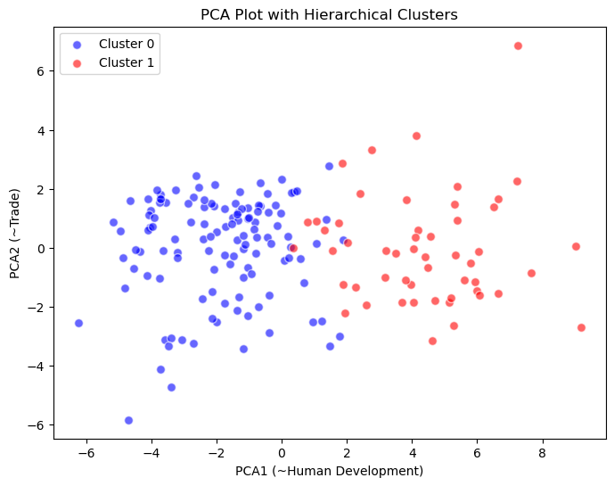

Although we can see a clear clusters, we cannot identify which region each data point belongs to. Thus, we assign each region a symbol and identify location that way. After implementing this we can visualize the dataset plotted against every pair of the 7 PCA components we have assigned semantic meaning to (PCA1 - PCA7). After the inspection of these graphs we have determined graphs plotted against PCA1 to be the most informative. Therefore, below are the graphs of every PCA component plotted against PCA1. 

 | 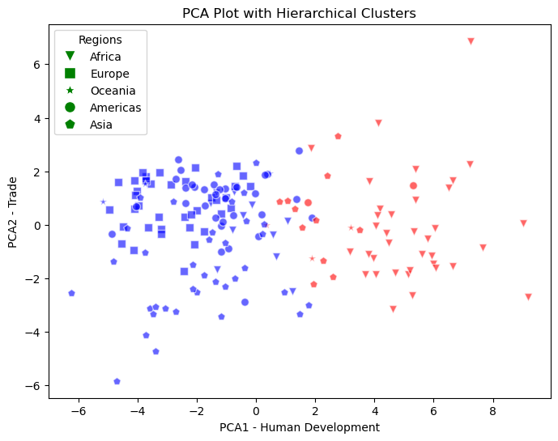 | 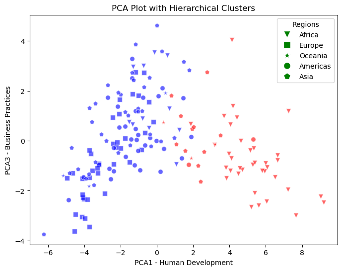 |
 | -----------------------------|------------------------------|    
 |  | 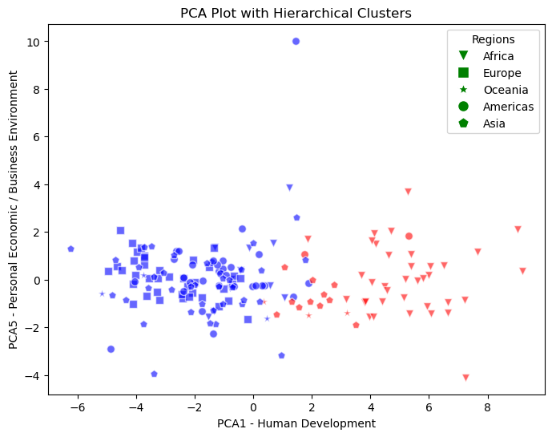 |
 | -----------------------------|------------------------------|
 | 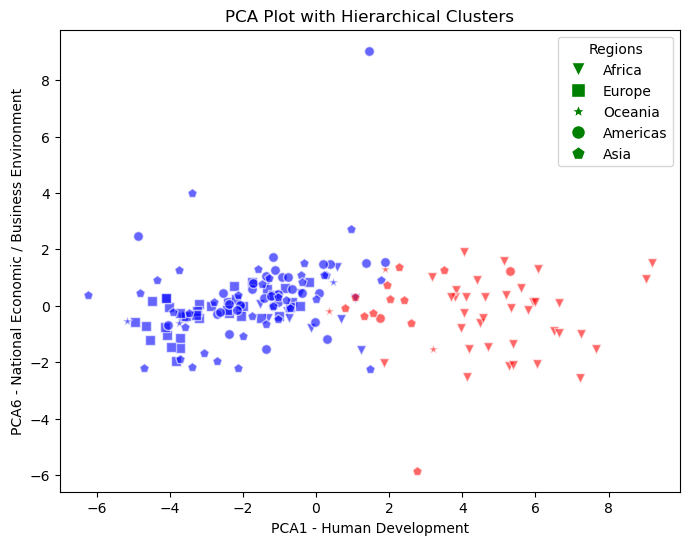 | 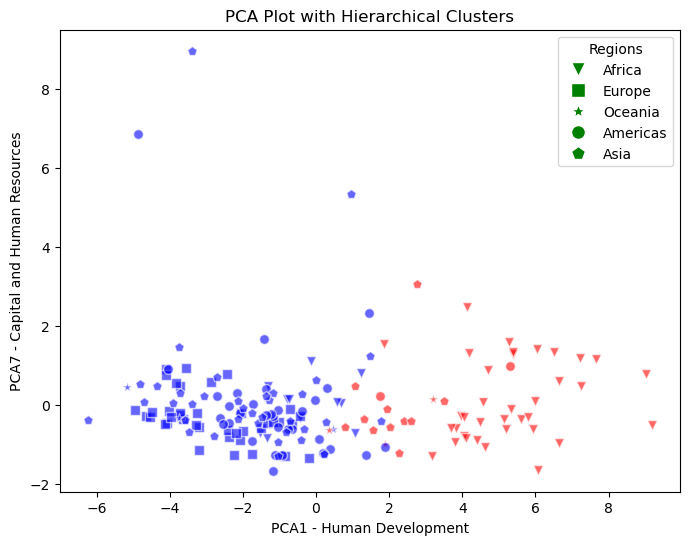 |

### Metrics 
```
Silhouette Coefficient: 0.26
Davies Bouldin Score: 1.62
```

### Hierarchical Clustering Findings 

TODO


## GMM
### BIC Score (Model Selection/Tuning)
Below is the result from a BIC score analysis. The BIC score roughly measures how good the GMM distribution is at predicting the true sample. A lower BIC score is optimal.
```python
def gmm_bic_score(estimator, X):
    return -estimator.bic(X)

param_grid = {
    "n_components": range(1, 27),
    "covariance_type": ["spherical", "tied", "diag", "full"],
}
grid_search = GridSearchCV(
    GaussianMixture(), param_grid=param_grid, scoring=gmm_bic_score
)
grid_search.fit(final_pca_25)
```
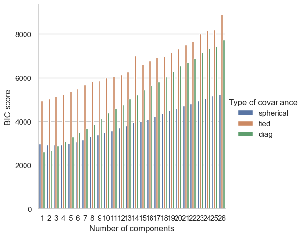

The above plot shows that the BIC score is lowest with 1 cluster, closely followed by 2 clusters, for a diagonal GMM distribution. We continued the analysis with the 2-cluster diagonal method. Further discussion on this discussion on this decision can be found in the findings section.

### GMM Visualizations
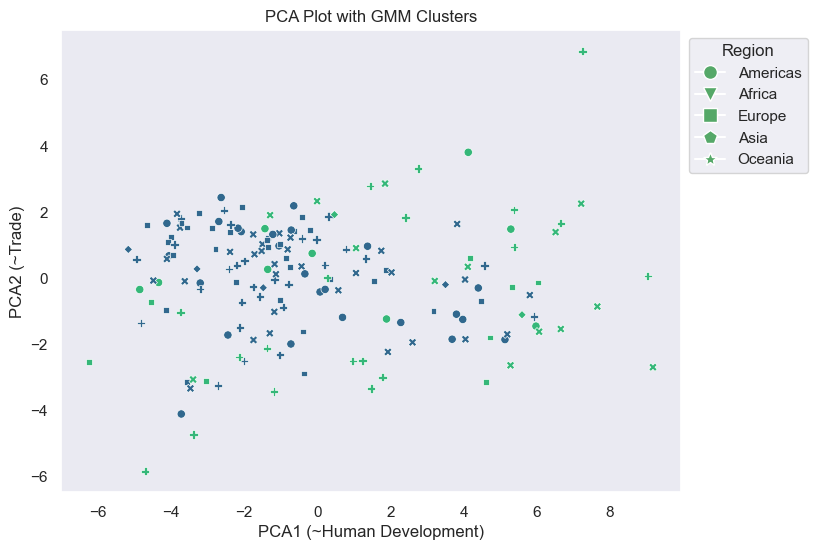

For a more granular regional breakdown, we can use sub-region definitions:
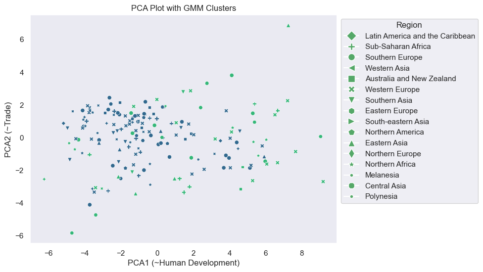

To analyze each region and sub-region in more detail, we can use pair plots:

**By Region**
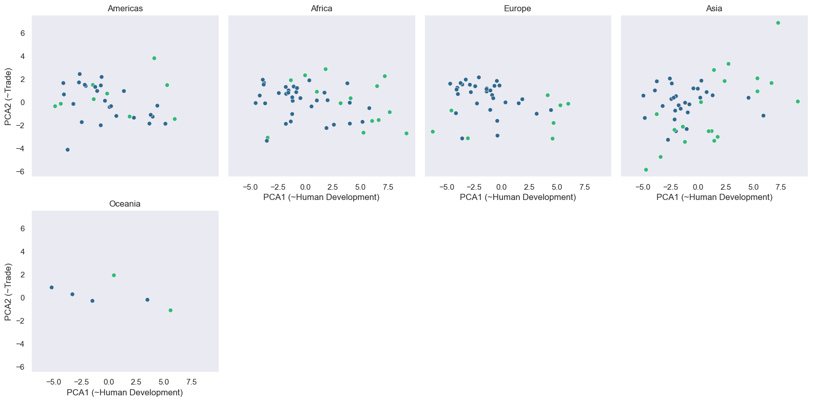
**By Sub-Region**
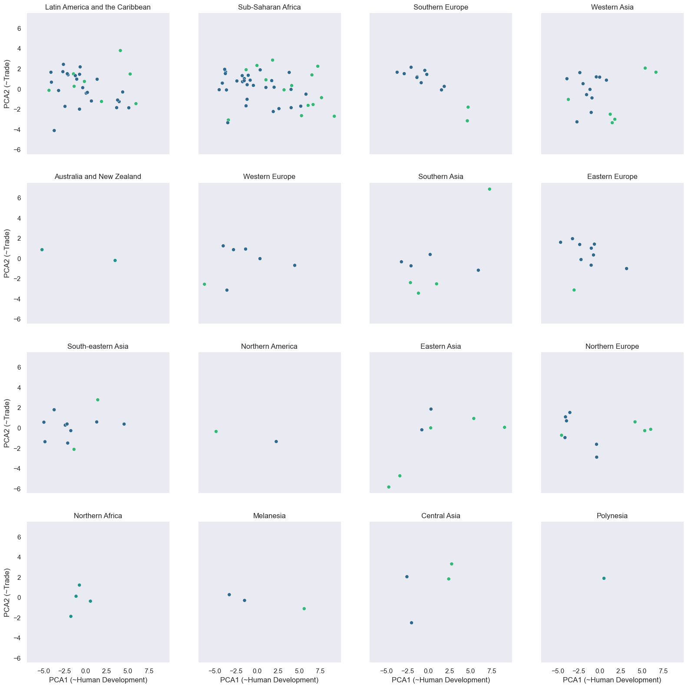

### Silhouette Score
Silhouette Coefficient: 0.219

### GMM Findings
GMM clustering does not appear to be highly effective for this data. The BIC score indicated that the best number of clusters is 1, however, the score for 2 clusters was not significantly worse. We chose to use two clusters to understand, through analysis and visualization, how GMM was separating countries.

Most regions have a balanced mix of nations regarding their development, economic, and sustainability metrics. Most notably, there appears to be no significant inter-regional trend- e.g. regions that are traditionally considered highly developed (Western Europe for instance) have many countries in the "Blue" cluster, but so do regions that are traditionally considered developing (Sub-Saharan Africa for instance). Such findings indicate that there is a balance between economic development and other sustainability metrics, such as emissions per capita. Such traditionally under-developed countries have much lower environmental impact per capita, and as a result, are grouped with traditionally developed countries due to their outsized performance on these metrics.

For intra-regional analysis, some notable outliers within their regions are:
- Ukraine (Eastern Europe): Ukraine has historically been an agrarian economy. Such economies are often less developed and produce fewer emissions. However, the region as a whole is generally considered a mix of more and less developed nations, so, notably, Ukraine is such an outlier.
- Hong Kong and Mongolia (Eastern Asia): Hong Kong, due to its size and lack of many natural resources, is necessarily an incredibly efficient (due to population density) nation with few industrial emissions. Mongolia is the least developed nation in the region and is somewhat agrarian.
- Spain and Albania (Southern Europe): Spain is extremely well developed in terms of human development, but suffers on a few economic measures like GDP per capita. However, due to their robust social services and public transit, it is not surprising that they perform well on other sustainability metrics. Albania is generally considered a developing European country and likely performs low on economic measures, but well on emissions and other sustainability metrics as a result.

# Regressions
Our clustering analysis found no strong relationship between sustainability and development metrics and a nation's region or sub-region. This is fairly surprising as inter-regional differences would be expected across continents due to historical development patterns. We want to verify these findings by using regression models.

For this analysis, we use two models: linear and Ridge regression. We test both models against region and sub-region labels, providing 4 total predictive models for comparison.

## Procedure

- Data was split into test and train sets with a test size of 0.2 or 20% of the total data.
- Labels were one-hot encoded. We chose one-hot encoding because the labels- country names- are not ordinal. We did not have enough labels for one-hot encoding to be computationally expensive. To avoid multicollinearity, the first dummy variable was dropped. This encoding was handled via pandas' ```get_dummies()``` function.

## Linear Regression
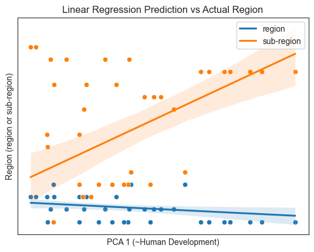

## Ridge Regression
We fit a Ridge regression for every alpha between 0 and 100, using increments of 2. From this, we determined that the **optimal alphas are 10 and 20** for region and sub-region Ridge regressions, respectively.

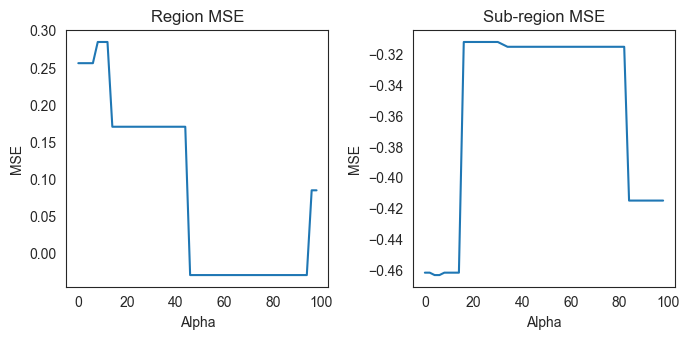

Using the alphas determined above, we plotted both Ridge regressions.

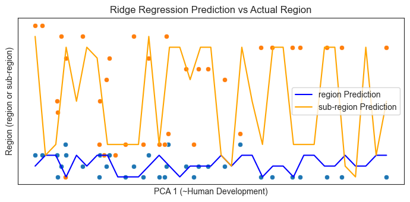

## Results

| Regression | RMSE | R<sup>2</sup> |
| ---------- | ---- | ----- |
| Linear (region) | 0.8619 | 0.2565 |
| Linear (sub-region) | 5.1796 | 0.4613 |
| Ridge (region) | 0.8452 | 0.2851 |
| Ridge (sub-region) | 4.9077 | 0.3119 | 

Predicting region has a much lower MSE error than predicting sub-region for both models. This indicates that using region to predict a nation's sustainability and development metrics is likely to be more accurate than using its sub-region. Notably, the R<sup>2</sup> values for sub-region are much higher than for region, indicating that sub-region explains more of the variation in a nation's sustainability metrics than its greater region. 

At first these results may appear contradictory, but this finding provides some potential insight into global development trends. First, it is important to note that there were many more categories for sub-region than region. This means that the probability of predicting a nation's region at random is much higher than selecting a nation's sub-region. Additionally, higher R<sup>2</sup> might simply be the result of more variation in sub-region than region due to the same mathematical fact. If we take the findings at face value, a region is more important for a nation's development and sustainability context, but a sub-region is much more useful for explaining the specific characteristics of that nation. More specifically, each sub-region might score fairly differently within its greater regional context due to sub-regional trends and environmental conditions which are more directly related to the conditions of a nation. For instance, take the entire African region. On the whole, it tends to have lower emissions per capita, but generally scores lower on development. Due to environmental, geographical, and historical conditions, each sub-region has developed quite differently within this general context; Northern Africa, which has a large trade volume with Europe, is very different than Sub-Saharan Africa, etc.

On the whole, these findings still indicate that there is not a strong relationship between a nation's region or sub-region and sustainability and development metrics. These results are consistent with our more detailed analysis in the GMM section.

# References 
Çağlar, M., Gürler, C. Sustainable Development Goals: A cluster analysis of worldwide countries. Environ Dev Sustain 24, 8593–8624 (2022). https://doi.org/10.1007/s10668-021-01801-6
<br />
<br />
Di Vaio, A., Palladino, R., Hassan, R., & Alvino, F. (2020a). Human resources disclosure in the EU Directive 2014/95/EU perspective: A systematic literature review. Journal of Cleaner Production, 257, 120509. https://doi.org/10.1016/j.jclepro.2020.120509
<br />
<br />
Mathrani, Anuradha, Jian Wang, Ding Li, and Xuanzhen Zhang. 2023. "Clustering Analysis on Sustainable Development Goal Indicators for Forty-Five Asian Countries" Sci 5, no. 2: 14. https://doi.org/10.3390/sci5020014

# Contribution Table

| Name        | Contribution|
| ----------- | ----------- |
| Ansh Vijay  | Setting up Github Pages <br /> Contribution Table <br /> UI of website <br /> Problem definition <br /> Dataset description <br /> Data Cleaning <br /> Hierarchical Clustering Metrics <br /> Hierarchical Clustering Visualizations|
| John Zhang  | Potential Results and Discussion <br /> DBSCAN <br /> Hierarchical Clustering <br /> Clustering Metrics|
| Nicholas Polimeni | Found dataset <br /> Introduction/Background <br /> Gannt Chart <br /> Feature Engineering <br /> PCA <br /> GMM <br /> Regressions <br /> Analysis|
| Lalith Siripurapu | Recording Video <br /> Methods <br /> PCA|

# Gantt Chart
[Link to Gantt Chart](https://gtvault-my.sharepoint.com/:x:/g/personal/npolimeni3_gatech_edu/EcyA5LHVj-VInbvsiN7a9zIBYMocgsMFTuQmjAW3kMClgQ?e=rHj83t)

# Data Set
[World Sustainability Dataset](https://www.kaggle.com/datasets/truecue/worldsustainabilitydataset?select=WorldSustainabilityDataset.csv)

# Video Link 
[Link to video](https://drive.google.com/file/d/1789Y8SjC8hon8YtUltt1fyv1lqtAgFSD/view?usp=sharing)

